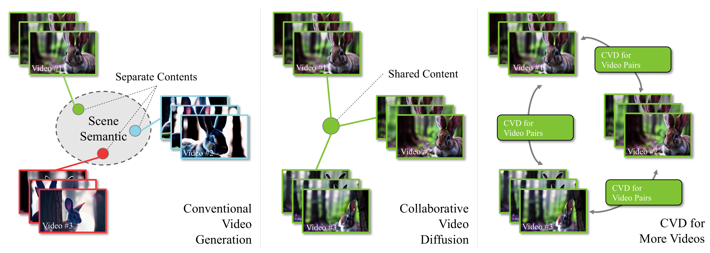

# Collaborative Video Diffusion: Consistent Multi-video Generation with Camera Control

**NeurIPS 2024**

This repository represents the official implementation of the paper titled "Collaborative Video Diffusion: Consistent Multi-video Generation with Camera Control".

*This repository is still under construction, many updates will be applied in the near future.*

[](https://collaborativevideodiffusion.github.io/)
[](https://arxiv.org/abs/2405.17414)

[Zhengfei Kuang*](https://zhengfeikuang.com/),
[Shengqu Cai*](https://primecai.github.io/),
[Hao He](https://hehao13.github.io/),
[Yinghao Xu](https://justimyhxu.github.io/),
[Hongsheng Li](https://www.ee.cuhk.edu.hk/~hsli/),
[Leonidas Guibas](https://www.cs.stanford.edu/people/leonidas-guibas),
[Gordon Wetzstein](https://stanford.edu/~gordonwz/ )

Research on video generation has recently made tremendous progress, enabling high-quality videos to be generated from text prompts or images. Adding control to the video generation process is an important goal moving forward and recent approaches that condition video generation models on camera trajectories make strides towards it. Yet, it remains challenging to generate a video of the same scene from multiple different camera trajectories. Solutions to this multi-video generation problem could enable large-scale 3D scene generation with editable camera trajectories, among other applications. We introduce collaborative video diffusion (CVD) as an important step towards this vision. The CVD framework includes a novel cross-video synchronization module that promotes consistency between corresponding frames of the same video rendered from different camera poses using an epipolar attention mechanism. Trained on top of a state-of-the-art camera-control module for video generation, CVD generates multiple videos rendered from different camera trajectories with significantly better consistency than baselines, as shown in extensive experiments.




## 🛠️ Setup

### 📦 Repository

Clone the repository (requires git):

```bash
git clone https://github.com/CVD
cd CVD
```

### 💻 Dependencies
For the environment, run:

```
conda env create -f environment.yaml

conda activate cameractrl

pip install torch==2.2+cu118 torchvision torchaudio --index-url https://download.pytorch.org/whl/cu118 

pip install -r requirements.txt
```
We require AnimateDiff and CameraCtrl to be built:
- DownLoad Stable Diffusion V1.5 (SD1.5) from [HuggingFace](https://huggingface.co/runwayml/stable-diffusion-v1-5/tree/main).
- DownLoad the checkpoints of AnimatediffV3 (ADV3) adaptor and motion module from [AnimateDiff](https://github.com/guoyww/AnimateDiff).
- Run `tools/merge_lora2unet.py` to merge the ADV3 adaptor weights into SD1.5 unet and save results to new subfolder (like, `unet_webvidlora_v3`) under SD1.5 folder.
- DownLoad the pretrained camera control model from [Google Drive](https://drive.google.com/file/d/1mlNaX8ipJylTHq2MHV2_mOQEegKr1YXc/view?usp=share_link).
- DownLoad Lora trained on Realestate10K at [Google Drive](https://drive.google.com/file/d/15zANcnn7aXatmklfVxRhFd57IfnCZxXn/view?usp=share_link).
- Download our synchronization module from [Google Drive](https://drive.google.com/file/d/1z6cR3PbqnrlVjXJJlk6AYxdl8z18hvtL/view?usp=sharing).

### 🔧 Configuration
Depends on where you store the data and checkpoints, you may need to change a few things in the configuration ```yaml``` file. We marked out the important lines you may want to take a look at in our exempler configurations files.

## 🏃 Inference
We provide two scripts to sample random consensus videos, namely the simplest two-video generation, and the advanced multi-video and complex trajectory video generation.
### 🎞️ Simple two-video generation
TBD
<!-- To sample the simplest setup of CVD, that is two videos representing the same underlying 4D scene, but captured from different camera poses, run the following:
```bash
python -m torch.distributed.launch --nproc_per_node=1 --master_port=29500 inference_epi_guidance.py \
    --out_root <PATH_TO_OUTPUT_VIDEOS> \
    --ori_model_path <PATH_TO_STABLE_DIFFUSION> --unet_subfolder unet_webvidlora_v3 \
    --pose_adaptor_ckpt <PATH_TO_CAMERACTRL>/CameraCtrl.ckpt \
    --motion_module_ckpt <PATH_TO_ANIMATEDIFF>/Motion_Module/v3_sd15_mm.ckpt \
    --epi_module_ckpt <PATH_TO_CVD_CHECKPOINTS>vd_checkpoints/hybrid_homo_stronger.ckpt \
    --model_config configs/train_epictrl/CVD.yaml \
    --visualization_captions assets/cameractrl_prompts.json \
    --zero_first_frame_scale \
    --image_height 256 \
    --image_width 256 \
    --n_procs 1 \
    --no_lora_validation \
    --guidance_scale 14 \
    --first_frame_guidance_scale 0 \
    --pose_adaptor_scale 1.0 \
    --global_seed 0 \
    --use_negative_prompt \
    --num_videos 8 \
    --civitai_base_model <PATH_TO>/Dreambooth_LoRA/realisticVisionV60B1_v51VAE.safetensors \
    --pose_file_0 assets/pose_files/2f25826f0d0ef09a.txt \
    --pose_file_1 assets/pose_files/2c80f9eb0d3b2bb4.txt
``` 

#### ⚙️ Inference settings

We provide two methods to sample camera trajectories of the two videos. You can either define:
- `--pose_file_0`: Camera trajectory for the first video.
- `--pose_file_1`: Camera trajectory for the second video.

Or not filling these two arguments, the model will then sample trajectories from RealEstate10K instead.

To specify the prompts, modify `assets/cameractrl_prompts.json`.

To run CVD on a LoRA model, simply specify either:
- `--civitai_base_model` for LoRA tuned base model, or
- `--civitai_lora_ckpt` for loading the LoRA checkpoints.

To get the best results, play around with `--guidance_scale`. Depends on the desired contents, we find range of 8-30 typically provide decent results.-->

### 🎞️ Adavanced generation
TBD

## Training
TBD

## 🎓 Citation

Please cite our paper:

```bibtex
@inproceedings{kuang2024cvd,
    author={Kuang, Zhengfei and Cai, Shengqu and He, Hao and Xu, Yinghao and Li, Hongsheng and Guibas, Leonidas and Wetzstein, Gordon.},
    title={Collaborative Video Diffusion: Consistent Multi-video Generation with Camera Control},
    booktitle={arXiv},
    year={2024}
}       
```