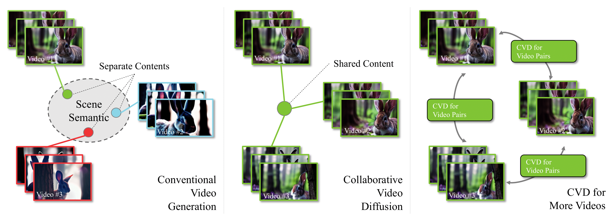

# Collaborative Video Diffusion: Consistent Multi-video Generation with Camera Control

**NeurIPS 2024**

This repository represents the official implementation of the paper titled "Collaborative Video Diffusion: Consistent Multi-video Generation with Camera Control".

*This repository is still under construction, many updates will be applied in the near future.*

[](https://collaborativevideodiffusion.github.io/)
[](https://arxiv.org/abs/2405.17414)

[Zhengfei Kuang*](https://zhengfeikuang.com/),
[Shengqu Cai*](https://primecai.github.io/),
[Hao He](https://hehao13.github.io/),
[Yinghao Xu](https://justimyhxu.github.io/),
[Hongsheng Li](https://www.ee.cuhk.edu.hk/~hsli/),
[Leonidas Guibas](https://www.cs.stanford.edu/people/leonidas-guibas),
[Gordon Wetzstein](https://stanford.edu/~gordonwz/ )

Research on video generation has recently made tremendous progress, enabling high-quality videos to be generated from text prompts or images. Adding control to the video generation process is an important goal moving forward and recent approaches that condition video generation models on camera trajectories make strides towards it. Yet, it remains challenging to generate a video of the same scene from multiple different camera trajectories. Solutions to this multi-video generation problem could enable large-scale 3D scene generation with editable camera trajectories, among other applications. We introduce collaborative video diffusion (CVD) as an important step towards this vision. The CVD framework includes a novel cross-video synchronization module that promotes consistency between corresponding frames of the same video rendered from different camera poses using an epipolar attention mechanism. Trained on top of a state-of-the-art camera-control module for video generation, CVD generates multiple videos rendered from different camera trajectories with significantly better consistency than baselines, as shown in extensive experiments.




## 🛠️ Setup

### 📦 Repository

Clone the repository (requires git):

```bash
git clone https://github.com/CVD
cd CVD
```

### 💻 Dependencies
For the environment, run:

```
conda env create -f environment.yaml

conda activate CVD

pip install torch==2.2+cu118 torchvision torchaudio --index-url https://download.pytorch.org/whl/cu118 

pip install -r requirements.txt
```
We require AnimateDiff and CameraCtrl to be built:
- DownLoad Stable Diffusion V1.5 (SD1.5) from [HuggingFace](https://huggingface.co/runwayml/stable-diffusion-v1-5/tree/main).
- DownLoad the checkpoints of AnimatediffV3 (ADV3) adaptor and motion module from [AnimateDiff](https://github.com/guoyww/AnimateDiff).
- Run `tools/merge_lora2unet.py` to merge the ADV3 adaptor weights into SD1.5 unet and save results to new subfolder (like, `unet_webvidlora_v3`) under SD1.5 folder.
- DownLoad the CameraCtrl's camera control model from [Google Drive](https://drive.google.com/file/d/1mlNaX8ipJylTHq2MHV2_mOQEegKr1YXc/view?usp=share_link).
- Download our synchronization module from [Google Drive](https://drive.google.com/file/d/1z6cR3PbqnrlVjXJJlk6AYxdl8z18hvtL/view?usp=sharing).

By default, all of the models should be downloaded to `./models` under the root directory.

<!-- 
### 🔧 Configuration
Depends on where you store the data and checkpoints, you may need to change a few things in the configuration ```yaml``` file. We marked out the important lines you may want to take a look at in our exempler configurations files. -->

## 🏃 Inference
We provide two scripts to sample random consensus videos, namely the simplest two-video generation, and the advanced multi-video and complex trajectory video generation.
### 🎞️ Simple two-video generation

To sample the simplest setup of CVD, that is two videos representing the same underlying scene, but captured from different camera poses, run the following:
```bash 
bash run_inference_simple.sh <GPU_IDX>
```
You might need to modify the model paths to your download location. 

#### ⚙️ Inference settings

We provide two methods to sample camera trajectories of the two videos. You will need to define:
- `--pose_file_0`: Camera trajectory for the first video.
- `--pose_file_1`: Camera trajectory for the second video.

To specify the prompts, modify `assets/cameractrl_prompts.json`.

To run CVD on a LoRA model, simply specify either:
- `--civitai_base_model` for LoRA tuned base model, or
- `--civitai_lora_ckpt` for loading the LoRA checkpoints.

To get the best results, play around with `--guidance_scale`. Depends on the desired contents, we find range of 8-30 typically provide decent results.

Feel free to tune the parameters (such as the guidance scale, LoRA weights) for variant results.

### 🎞️ Adavanced generation
In addition to paired video generation, we also provide scripts for generating more videos. Here we provide three settings of camera trajectories:
- 'circle': Each camera trajectory starts from the same position, and spans out to different locations on a circle perpendicular to the look-at direction.
- 'upper_hemi': similar to the 'circle' mode, but only covers the upper hemicircle. (No camera trajectory moves underwards)
- 'interpolate': Each camera trajectory starts from the same position, and move to a target interpolated from two given positions.
To generate arbitrary views under these patterns, run: 
```bash 
bash run_inference_advanced.sh <GPU_IDX> <circle/upper_hemi/interpolate> <VIEW_NUM(3-6)>
```

#### ⚙️ Inference settings
Different from the simple mode, here the camera poses are procedurally generated in the scripts. Hence the pose files are not required here. Instead, 
- '--cam_pattern' determines how the camera are generated.

Some other important parameters:
- '--view_num': the number of views that will be generated.
- '--multistep': Number of recurrent steps for each denoising step. Set to 3 for 4 view generation and 6 for 6 view generation by default.
- '--accumulate_step': Number of pairs assigned to each video. Set to 1 for 4 view generation and 2 for 6 view generation by default.

<!-- 
## Training
TBD -->

## 🎓 Citation

Please cite our paper:

```bibtex
@inproceedings{kuang2024cvd,
    author={Kuang, Zhengfei and Cai, Shengqu and He, Hao and Xu, Yinghao and Li, Hongsheng and Guibas, Leonidas and Wetzstein, Gordon.},
    title={Collaborative Video Diffusion: Consistent Multi-video Generation with Camera Control},
    booktitle={arXiv},
    year={2024}
}       
```